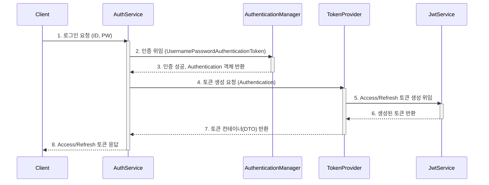
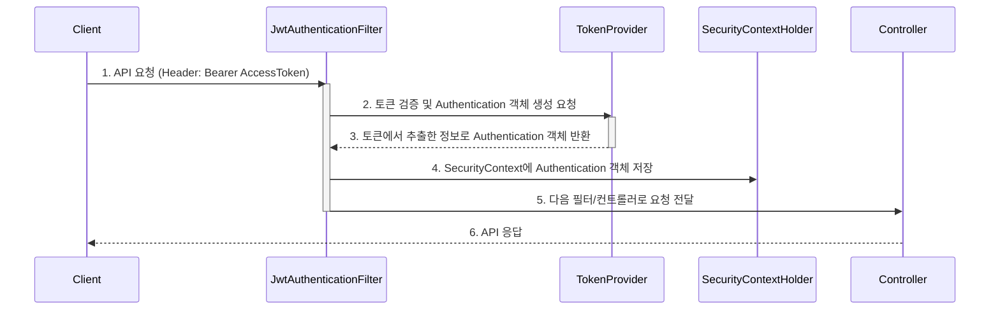
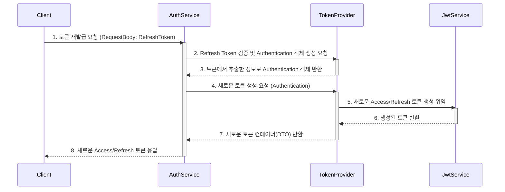
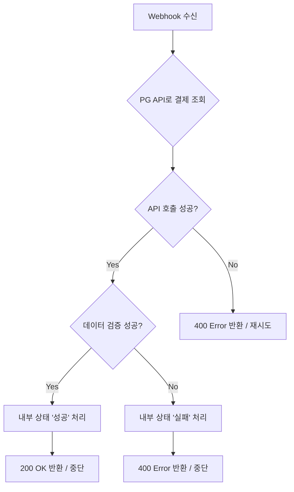
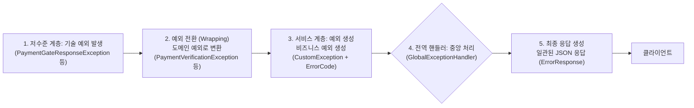

# 카카오같이가치 백엔드 클론코딩

🔗https://together.kakao.com/

카카오 같이 가치 핵심 기능을 RESTful API으로 클론 코딩한 백엔드 서버 프로젝트입니다.
<br><br><br>

---
## ERD Structure


---
<br><br><br>

## 🔎 주요 기능
- [🏷️ 인증](#인증)
  - SpringSecurity 인증, 인가
  - JWT 토큰(accessToken, refreshToken) 기반 사용자 인증
- [🏷️ Redis 캐싱](#redis캐싱)
  - 회원가입, 비밀번호 수정 시 본인확인용 코드 캐싱
- [🏷️ 메일 발송](#메일발송)
  - SMTP 메일 기능 모듈화
- [🏷️ 결제](#결제)
  - 결제 위조 방지 및 사용자 경험 향상 지향
- [🏷️ 게시글](#게시글)
  - 임시저장 기능으로 사용자 경험 향상
- 🏷️ 파일 업로드
  - 파일 스토리지 분리
  - 데이터 정합성을 위한 파일의 전체 생명주기 관리
- 🏷️ 애플리케이션 비즈니스
  - 유저
  - 기부
  - 모금
- [🏷️ 예외 처리](#예외처리)

<br><br><br>
---
## 인증
### 📌 로그인 및 토큰 발급 흐름
🔗 관련 디렉토리
- 로그인 요청 처리[AuthService](src/main/java/com/kakao/together/service/auth/impl/AuthServiceImpl.java)
- 토큰 생성[JwtTokenProvider](src/main/java/com/kakao/together/token/JwtTokenProvider.java)
- 토근관련[token](src/main/java/com/kakao/together/token)

## 가나바
### 📌 access token 기반 인증 흐름
🔗 관련 파일
- accessToken 인증 필터 [JwtAuthenticationFilter](src/main/java/com/kakao/together/filter/JwtAuthenticationFilter.java)
- access토큰 파싱 및 인증객체 반환 클래스 [JwtTokenProvider](src/main/java/com/kakao/together/token/JwtTokenProvider.java)
- 토근관련[token](src/main/java/com/kakao/together/token)


### 📌 토큰 재발급 흐름
🔗 관련 디렉토리
- 로그인 요청 처리[AuthService](src/main/java/com/kakao/together/service/auth/impl/AuthServiceImpl.java)
- 토큰 생성[JwtTokenProvider](src/main/java/com/kakao/together/token/JwtTokenProvider.java)
- 토큰관련[token](src/main/java/com/kakao/together/token)

<br><br><br>

## Redis캐싱
 🔗 [RedisService](src/main/java/com/kakao/together/external/redis/RedisService.java)
 - DB에 접속하지 않고 빠른 조회를 위해 Redis을 사용하여 캐시 기능을 구현했습니다.
 - Redis서버에 데이터를 저장하는 setData 함수는 일반 문자열 뿐 아니라 일반 객체도 저장할 수 있도록 메소드를 구분했습니다.
 - Redis 데이터 처리 중 발생하는 예외는 RedisServiceException.java라는 예외 클래스로 래핑하여 캐시 기능 호출부에서 적절한 예외처리를 할 수 있도록 구성하였습니다.
 - 실제로 프로젝트 내 redis 저장소를 사용하는 로직은 다음과 같습니다.
    - [PG사 토큰 캐싱](src/main/java/com/kakao/together/external/redis/RedisTokenProvider.java)
    - [refresh토큰 캐싱](src/main/java/com/kakao/together/external/redis/RedisTokenRepository.java)
<br><br><br>

## 메일발송
🔗 [SmtpMAilService](src/main/java/com/kakao/together/external/mail/SmtpMailService.java)<br>
🔗 [EmailTemplate](src/main/java/com/kakao/together/util/EmailTemplate.java)
- 메일 내용에 해당하는 부분은 별도의 Template 클래스로 분리하여 메일 발송 기능만 책임지도록 하였습니다.
- YAML 파일을 활용하여 애플리케이션의 설정 값과 비즈니스 상수들을 분리하고 모듈화함으로써 재사용성과 유지보수성을 향상시켰습니다.
<br><br><br>

## 결제
PaymentGate 결제 대행사로부터 결제 승인 정보(imp_uid, merchant_uid)을 받아 서버 내부 결제 교차검증을 진행하는 방식으로 결제 기능을 구현하였습니다. 
🔗 [결제검증서비스](src/main/java/com/kakao/together/service/paymentgate/impl/PortOneVerificationService.java)


### 📌 중점을 둔 요소
- 단순 결제 검증 후 완료처리에서 그치지 않고 검증 성공/실패에 따라 서버 내부 데이터 상태의 생명주기를 관리할 수 있도록 하였습니다.
- PaymentGate에 매 요청 시 토큰을 재발급 받지 않도록 acceessToken을 redis으로 캐싱[RedisTokenProvider](src/main/java/com/kakao/together/external/redis/RedisTokenProvider.java)
  - 토큰이 존재하지 않는 경우에만 PG사에 토큰 발급 요청
  - 이식성을 고려하여 직렬화방식 점검하는 checkSerializerConfiguration 메소드 작성
- 유지보수 향상, 재사용을 위해 PG사 통신 로직, 서버 내 결제 정보 불러오는 로직, 결제 검증 로직, 결제 완료 후 처리 로직을 분리
  - PG사 통신 로직은 [PortOneClient](src/main/java/com/kakao/together/external/paymentgate/service/impl/PortOneClient.java)에서만 책임
  - 결제 검증 완료 후 처리 로직은 [PaymentInternalServiceImpl](src/main/java/com/kakao/together/service/payment/internal/PaymentInternalServiceImpl.java)에서 책임
  - 서버 내 결제 정보 불러오는 로직은 [PaymentDetailServiceImpl](src/main/java/com/kakao/together/service/paymentgate/impl/PaymentDetailsServiceImpl.java)에서 책임. 결제 검증 클래스에서 다른 클래스에 불필요하게 의존하는 것을 줄여주었습니다.
- 결제 검증 실패 시 트랜잭션 처리
  - 결제 검증 실패 시 서버 내부 결제 상태를 '실패'상태로 바꾸는 로직은 다른 트랜잭션의 영향에 받지 않도록 Propagation.REQUIRES_NEW 속성을 부여함.
    ```
     @Override
    @Transactional(propagation = Propagation.REQUIRES_NEW)
    public void failCancelDonation(Long donationId) {
        Donation donation = donationRepository.findById(donationId)
                .orElseThrow(() -> new NoSuchElementException("요청한 엔티티가 존재하지 않습니다; donationId: " + donationId));
        donation.failCancelDonation();
    }
    ```
- 다른 서비스와 마찬가지로 커스텀 예외를 정의해서 각 상황별로 대처할 수 있도록 하였습니다. [PaymentGateException](src/main/java/com/kakao/together/external/paymentgate/exception) [PaymentException](src/main/java/com/kakao/together/exception/payment)
  - PaymentGateException(PG사 통신 예외)
    - PaymentGateResponseException, PaymentGateTokenException 등..
  - PaymentException(결제관련 예외)
    - PaymentVerificationException, PaymentCompleteException 등..
    
    

## 예외처리
### 📌 중점을 둔 요소
- 유지보수성 향상
  - 전역예외처리 클래스에서 일괄 예외 응답 처리를 담당하여 예외 응답 방식 수정은 이 파일에서만 책임지도록 하였습니다. 🔗[GlobalExceptionHandler](src/main/java/com/kakao/together/exception/GlobalExceptionHandler.java)
- 일관성 있는 응답
  - 발생가능 예외를 ErrorCode에 사전에 정의하였습니다. 🔗[ErrorCode](src/main/java/com/kakao/together/exception/ErrorCode.java)
  - 예외 유형에 따른 예외 응답 객체(ErrorResponse) 다르게 생성합니다. 🔗 [ErrorResponse](src/main/java/com/kakao/together/exception/ErrorResponse.java)
- 디버깅 용이성
  - 던져진 예외는 상단에서 CustomException으로 감싸서 전역 예외처리로 던져집니다. 🔗 [CustomException](src/main/java/com/kakao/together/exception/CustomException.java)
  - 저수준 모듈에서 발생한 예외들의 cause을 CustomException이 catch할 때까지 넘겨주어 예외 추적을 용이하게 만들었습니다. 





