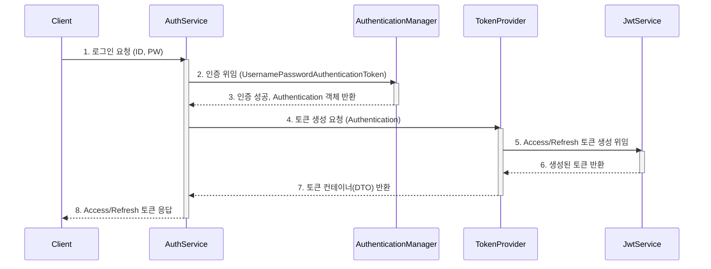
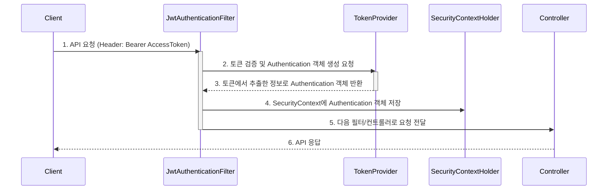
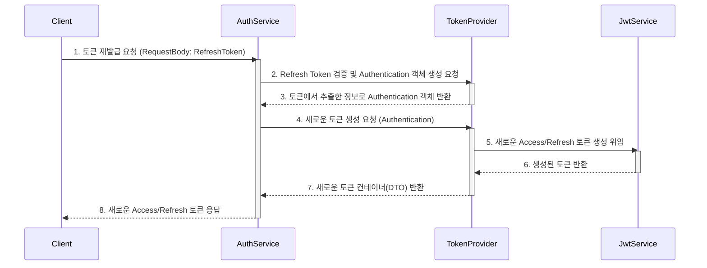
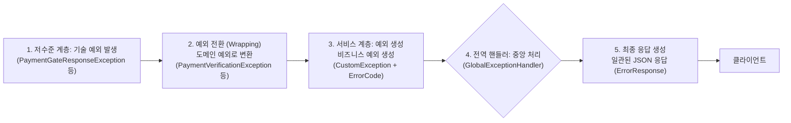

# 카카오같이가치 백엔드 클론코딩

🔗https://together.kakao.com/

카카오 같이 가치 핵심 기능을 RESTful API으로 클론 코딩한 백엔드 서버 프로젝트입니다.
   

---
## ERD Structure

---
   

## 🔎 주요 기능
### 보안
- SpringSecurity 인증, 인가
- JWT 토큰(accessToken, refreshToken) 기반 사용자 인증
### Redis 캐싱
- 회원가입, 비밀번호 수정 시 본인확인용 코드 캐싱
### 메일 발송
- SMTP 메일 기능 모듈화
### 결제
- 결제 위조 방지 및 사용자 경험 향상 지향
### 게시글
- 임시저장 기능으로 사용자 경험 향상
### 파일 업로드
- 파일 스토리지 분리
- 데이터 정합성을 위한 파일의 전체 생명주기 관리
### 애플리케이션 비즈니스
- 유저 
- 기부
- 모금
### 예외 처리

   
---
## 🏷️보안

### 📌 로그인 및 토큰 발급 흐름

### 📌 access token 기반 인증 흐름

### 📌 토큰 재발급 흐름

   

## 예외처리
### 📌 중점을 둔 요소
- 일관성 있는 응답
- 유지보수성 향상
- 디버깅 시 예외 추적

